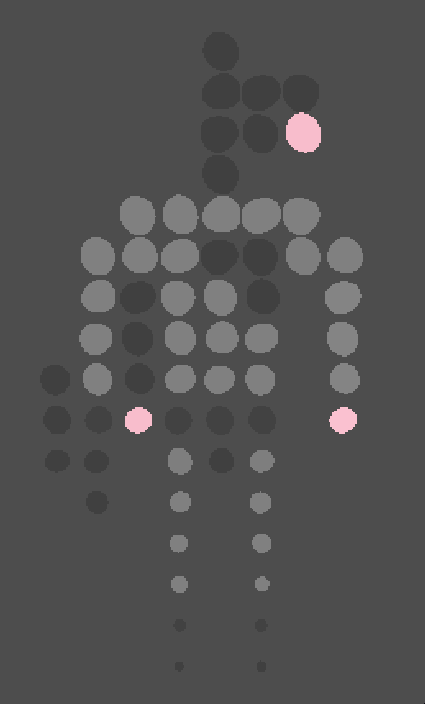

# Cirxels Shader

By ItsNorin: https://github.com/ItsNorin/GodotStuff

Turns pixels into circles.

## Features:
- Adjustable radius
- Optional animated jiggle with speed and min/max radius
- Optional circle sizing based off of image alpha channel
